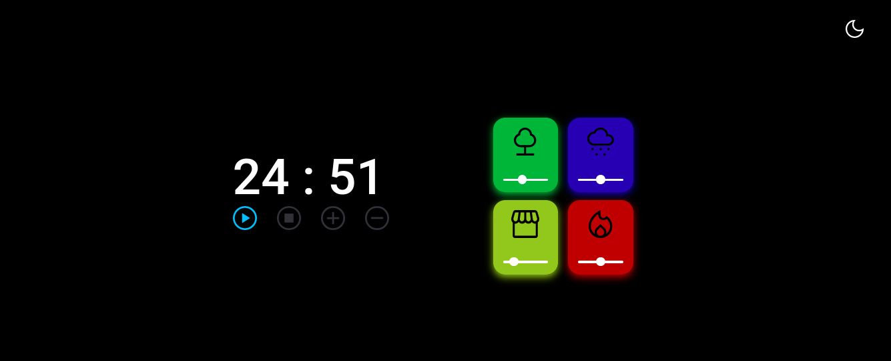

  

## 🚀 Tecnologias

Esse projeto foi desenvolvido com as seguintes tecnologias:

- [HTML](https://developer.mozilla.org/pt-BR/docs/Web/HTML)
- [CSS](https://developer.mozilla.org/pt-BR/docs/Web/CSS)
- [JSS](https://developer.mozilla.org/pt-BR/docs/Web/JavaScript)
## 💻 Projeto

O projeto Rocket Pomodoro Dark é uma aplicação que disponibiliza um timer simples com alguns som de fundo e dark mode, ele foi elaborado no desafio do stage 05 no programa Explorer da Rocketseat.

